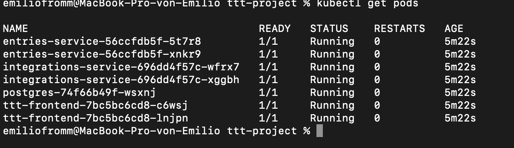
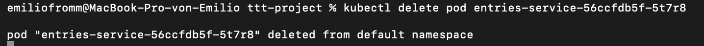
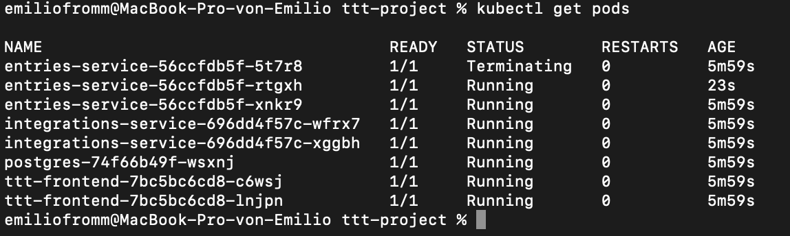
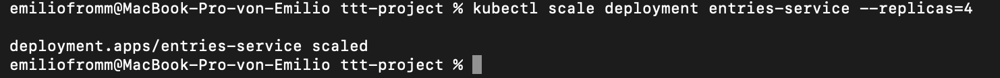
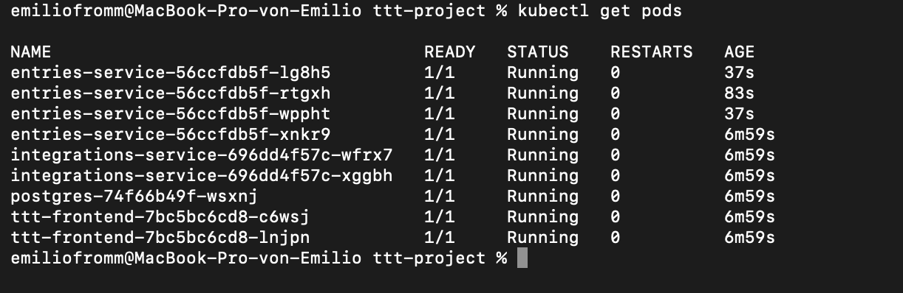

# TTT — Tool Task Tracker

A whiteboard-styled productivity hub. Log in, pick the tools you use (GitHub, Notion, Figma, Discord, ...),
and stick tasks, deadlines, notes and images to each one like Post-its on a corkboard, one board per calendar
day. GitHub is wired up as a real integration (via a Personal Access Token) and shows your live issues/PRs.
"Daily News" is a selectable tool too — it shows one cached, English-language headline per day from a free,
keyless news API (see `NEWS_API_URL` in `.env.example`).

## Architecture

```
frontend/                 React + Vite SPA (whiteboard/post-it UI)
services/entries-service/     Node/Express — users, tools, entries (tasks/notes), images
services/integrations-service/ Node/Express — GitHub PAT integration, favicon lookup, issue cache
azure-functions/
  thumbnail-generator/    Blob-trigger — makes a thumbnail whenever an image is uploaded
  github-cache/           Timer-trigger — refreshes cached GitHub issues every 15 min
k8s/                       Kubernetes manifests (Deployment/Service/Ingress) for Minikube or AKS
docker-compose.yml         Local dev: frontend + both services + Postgres + Azurite (Blob emulator)
```

Two microservices talk to two separate Postgres schemas/databases and are only ever called over REST
by the frontend — they never call each other directly, so failure in one doesn't take down the other.

## 1. Local development (day-to-day)

Requirements: Docker Desktop.

```bash
cp .env.example .env        # fill in JWT_SECRET, GITHUB defaults if you want
docker-compose up --build
```

This starts:
- `frontend` on http://localhost:5173
- `entries-service` on http://localhost:4000
- `integrations-service` on http://localhost:4001
- `postgres` on localhost:5432 (two databases: `entries_db`, `integrations_db`, both auto-migrated on boot)
- `azurite` on localhost:10000 (local Blob Storage emulator, so you don't need a real Azure account yet)

Hot reload is on for both frontend (Vite) and backend (nodemon), so this is where you'll do ~90% of your
testing while building.

## 2. Kubernetes test (Minikube)

```bash
minikube start
minikube addons enable ingress        # needed for k8s/ingress.yaml
eval $(minikube docker-env)          # build images straight into minikube's docker
docker build -t ttt-frontend ./frontend
docker build -t ttt-entries ./services/entries-service
docker build -t ttt-integrations ./services/integrations-service

# k8s/config.yaml's AZURE_STORAGE_CONNECTION_STRING still has the local Azurite placeholder --
# swap it for a real Azure Storage Account connection string first, or image uploads will fail
# inside the cluster (there's no Azurite pod in k8s/).

kubectl apply -f k8s/
echo "$(minikube ip) ttt.local" | sudo tee -a /etc/hosts
```

Access it through the ingress at `http://ttt.local/`, not `minikube service ttt-frontend --url`.
The frontend talks to the backends over relative paths (`/api/entries`, `/api/integrations`) that only
the ingress (`k8s/ingress.yaml`) knows how to route to the right Service — `minikube service` on the
frontend alone bypasses the ingress and the API calls would 404.

## 3. Cloud deployment

- **Frontend** → Netlify or Vercel: connect the repo, root dir `frontend`, build command `npm run build`,
  publish dir `dist`.
- **entries-service / integrations-service** → Render.com: "New Web Service" per folder, Render reads
  the Dockerfile automatically. Add the env vars from `.env.example`.
- **Postgres** → Render's free Postgres, or Azure Database for PostgreSQL.
- **Blob Storage** → a real Azure Storage Account (swap `AZURE_STORAGE_CONNECTION_STRING` from Azurite's
  dev value to the real one — nothing else changes). Note: "Allow Blob public access" needs to be enabled
  on the storage account, since post-it images are served via plain public URLs.
- **Azure Functions** → deploy `azure-functions/*` via the Azure Functions Core Tools or VS Code extension.

## Where things run

The hosted version linked in the submission — frontend, both backends, the databases, storage — runs on
Netlify, Render, and Azure. None of that involves Kubernetes.

Kubernetes orchestration is demonstrated separately, via Minikube run locally rather than hosted
continuously. Azure Kubernetes Service was the first option, but the VM SKUs an AKS node pool needs are
blocked on our student subscription's quota, so Minikube is what actually runs the Deployment/Service/
Ingress setup below.

- **Netlify** — frontend
- **Render** — both backend microservices and their Postgres databases
- **Azure** — Blob Storage and both serverless Functions

### Kubernetes evidence

1. Baseline — 7 pods up (2× `entries-service`, 2× `integrations-service`, 2× `ttt-frontend`,
   1× `postgres`), all `Running`, `0` restarts:

   

2. Self-healing — one `entries-service` pod deleted on purpose:

   

   `kubectl get pods` right after: the deleted pod is still `Terminating`, and a replacement is already
   `Running` (`...-rtgxh`, age `23s`) — the Deployment's replica count triggered that on its own:

   

3. Scaling — `entries-service` scaled up on purpose:

   

   `kubectl get pods` right after: 4 `entries-service` pods running instead of 2 (9 pods total):

   

## Environment variables

See `.env.example` in the repo root — copy it to `.env` before running docker-compose.
